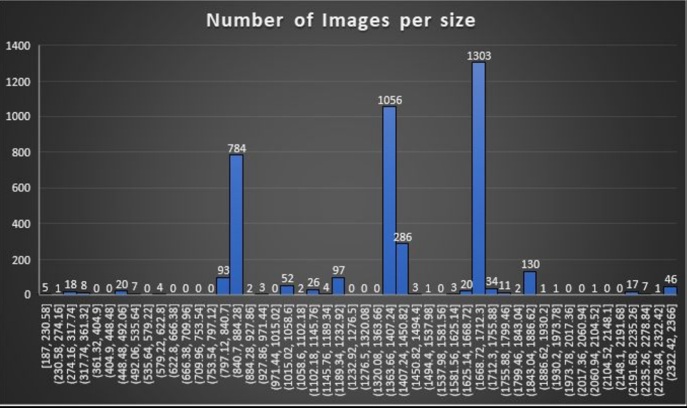

# Detection of Welding Defects in Radiographic Images
This repository contains the code and analysis of unlabeled radiographic images used to find defects in different welding images. The dataset received was around 14GB consisting of 3.9K images, which were unstructured. Each image consisted of several welding images stacked on top of each other. The number of images stacked on each other was not consistent, so a complete analysis of the dataset was conducted. After understanding the distribution, the images were split. Then resized and input into predefined models Resnet50 and Inception V3. From these models, we noted the features vectors obtained from them. Finally we validated if a set of images are appropriately classified based on the feature vectors. 

For more information, please go through the detailed [project report](IP_Project_Report.pdf) as well as the [final presentation](IP_Final_presentation.pdf). They contain the results for each stage of the project.

Done By:  
Chandravaran Kunjeti 
Janavi N

## Table of Contents
1. [Data Distribution](#Data-Distribution)
2. [Code](#code)
3. [Feature Vectors](#Feature-Vectors)

## Data Distribution

The above graph is a distribution of size of the images which was given. This analaysis of the data gave us an idea of the number of images where stacked on top of each other. In the above graph we can see 3 main spikes, the first one coresponds to 2 welding images stacked on each other, the second spike is 3 images stacked on each other, the final one represents 4 images on top of each other. The last few bins contained 5 Images stacked on top of each other.

## Code
[size_finding.py](size_finding.py) 
This code gives us the number of imgaes in a bin and the dimensions of the dataset. Run for the entire set of 3.9k images.Output stored in an exel sheet.

[number_of_x_rays.ipynb](number_of_x_rays.ipynb) 
This file gives us the number of stacked xrays per image of the dataset (e.g 3 ,4 or 5 per radiographic image). Run for the entire datase. Output stored in exel sheet

[final_splitting.ipynb](final_splitting.ipynb) 
This file helps in splitting the radiographic images according to the number of xrays stacked in each. It is run for the entire dataset, output images stored in the given directory

[cut_pics.ipynb](cut_pics.ipynb) 
This file cuts a sample taken from the split images to a dimension as desired. The dimension of cutting is based on the original size of the image. Images stored in the same directory.

[resizingcode.ipynb](resizingcode.ipynb)  
This file reads the sample cut imgaes obtained from CUTPICS.ipynb and resizes them to the dimensions 299x299 and 299x500 so these images can be given as input for the feature extraction done by the pre trained CNN models.Images stored in directory mentioned.

[feature_extraction.ipynb](feature_extraction.ipynb) 
This file gives the feature vectors for the images run in it and stores the vectors in an exel sheet. after extracting the vectors, the code also runs to find the distances between 100 sample images and the 80 images of defective and non defective images.These distances are again stored in exel sheet. This code is run for both the CNN models, Resnet50 and inception_v3.

[removing_letters.py](removing_letters.py)  
This has the first part of removing letters in a picture it is finds the letters that are present in the welding images. It is a mask that can be used to remove the letters from the radiographic images to improve accuracy of detection.

## Feature Vectors

[feature_299_299.xlsx](feature_files/feature_299_299.xlsx), [feature_299_500.xlsx](feature_files/feature_299_500.xlsx) contain the feature vectors for the 80 labeled data through Resnet50. 

[feature_v3_299_299.xlsx](feature_files/feature_v3_299_299.xlsx), [feature_v3_299_500.xlsx](feature_files/feature_v3_299_500.xlsx) contain the feature vectors for the 80 labeled data through Inception V3. 

[feature_distance_299_299.xlsx](feature_files/feature_distance_299_299.xlsx), [feature_distance_299_500.xlsx](feature_files/feature_distance_299_500.xlsx) contains the feature vector distance of the 100 sample data to 80 labeled data using feature vectors found via Resnet50. 

[feature_distance_v3_299_299.xlsx](feature_files/feature_distance_v3_299_299.xlsx), [feature_distance_v3_299_500.xlsx](feature_files/feature_distance_v3_299_500.xlsx)  contains the feature vector distance of the 100 sample data to 80 labeled data using feature vectors found via Inception V3. 